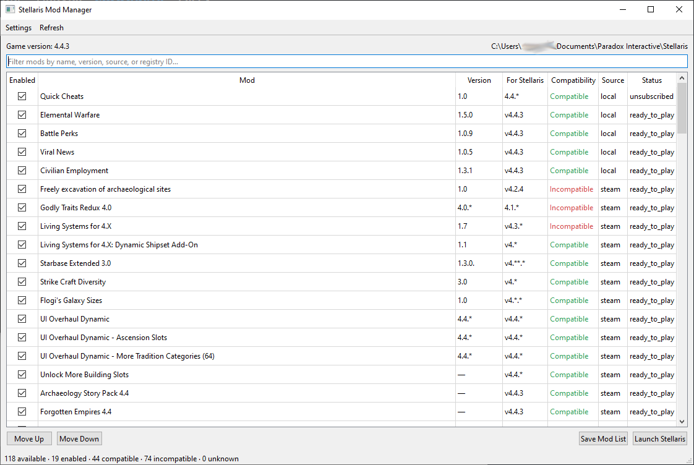

# Stellaris Mod Manager + Launcher


For windows users you can get the EXE here https://github.com/non-npc/Stellaris-Mod-Manager/releases/download/v0.1.0/StellarisModManager_v010.zip

A small PyQt6 desktop manager that reads available mods from Paradox's
`launcher-v2.sqlite`, displays version compatibility, and writes the enabled
load order to the `dlc_load.json` file consumed by Stellaris. The manager keeps
its own `stellaris-mod-manager.sqlite` database for the user's checkbox state
and complete display order.

The Paradox launcher database is always opened read-only. Saving creates a
timestamped backup of the existing `dlc_load.json` before replacing it
atomically.

Select the mods you want to load, click save list, then click refresh and the UI will update and you can re-order the mods.

## Mod installation

This application manages which existing mods are enabled and their load order.
It does not download, install, update, or uninstall mods. Steam Workshop or the
Paradox Launcher is still required to install and uninstall mods and keep them
updated.

## Features

- Automatic Windows and Linux path detection, with configurable overrides.
- First-run game-folder selection, followed by automatic user-data detection.
- A user-data folder prompt when platform-specific detection is unsuccessful.
- Available-mod discovery from `launcher-v2.sqlite`.
- Current game version detection from `launcher-settings.json`.
- Compatibility indicators based on each mod's `requiredVersion`.
- Enable/disable controls and enabled-mod load-order controls.
- Search/filtering.
- Direct game launching from the configured game folder.

## Run

From this directory:

```
python main.py
```

Windows users can also double-click `run_manager.bat`.

Install dependencies if PyQt6 is not already available:

```
python -m pip install -r requirements.txt
```

On Linux, use the same commands in a terminal. The default data path is
`~/.local/share/Paradox Interactive/Stellaris`, and common Steam installation
locations are detected automatically.

## Important files

- Windows user data:
  `%USERPROFILE%\Documents\Paradox Interactive\Stellaris`
- Linux user data:
  `~/.local/share/Paradox Interactive/Stellaris`
- Mod database:
  `launcher-v2.sqlite`
- Active game load order:
  `dlc_load.json`

Close the Paradox Launcher before saving if you intend to reopen it afterward:
the launcher may rewrite `dlc_load.json` from its own active playset.

## Unit tests

Run the bundled unit tests from the project directory:

```powershell
python -m unittest discover -s tests -v
```

The tests cover mod-version compatibility matching, NumPy compatibility
summaries, `dlc_load.json` updates, preservation of unrelated JSON fields,
duplicate removal, and backup creation.
